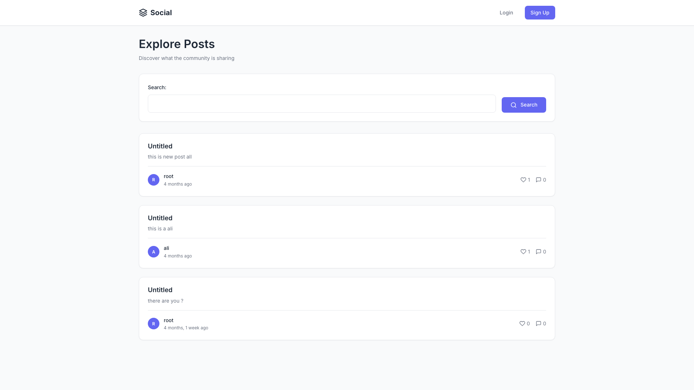
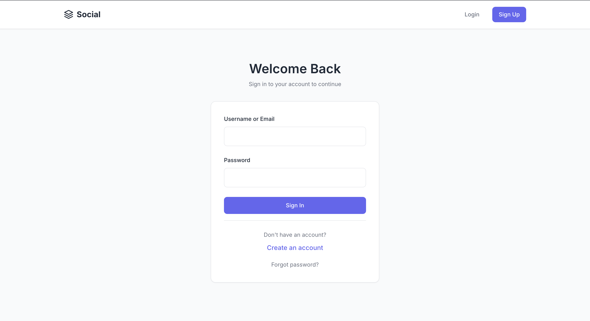
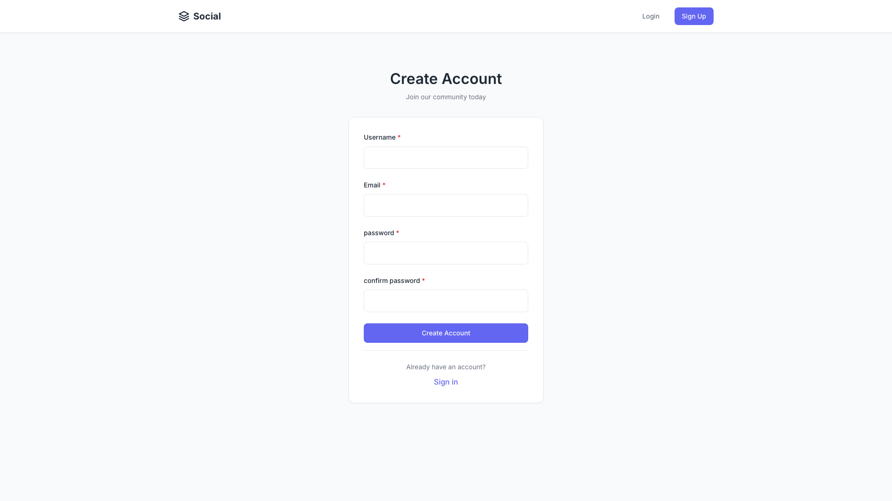
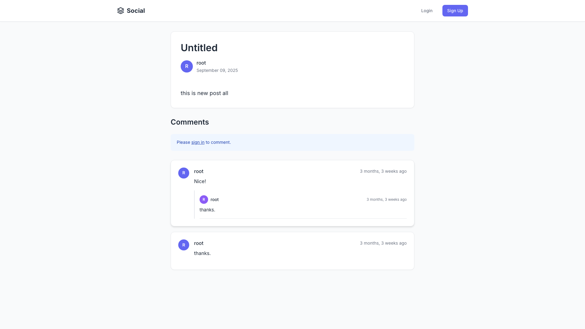
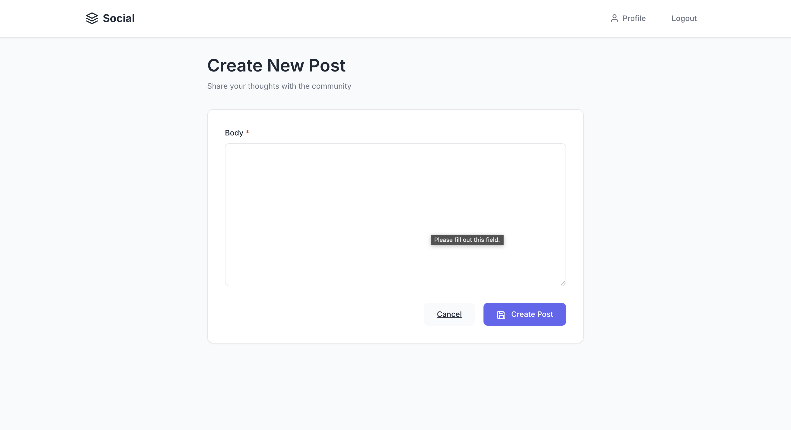
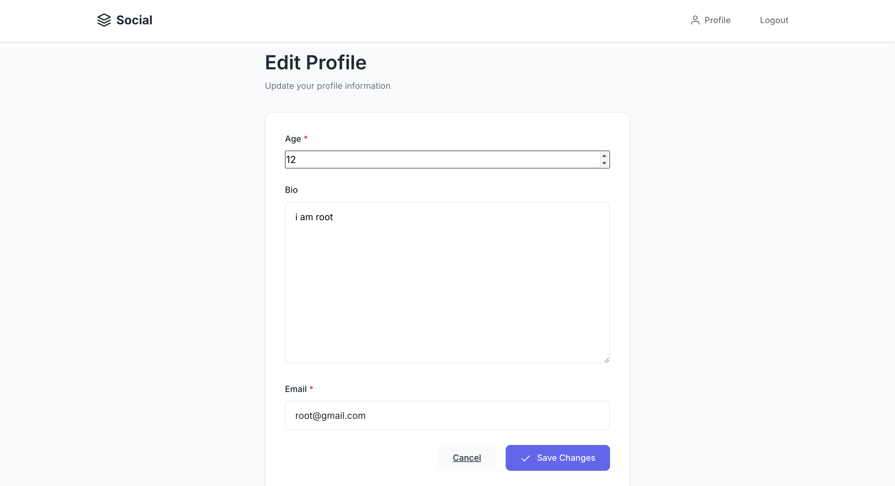
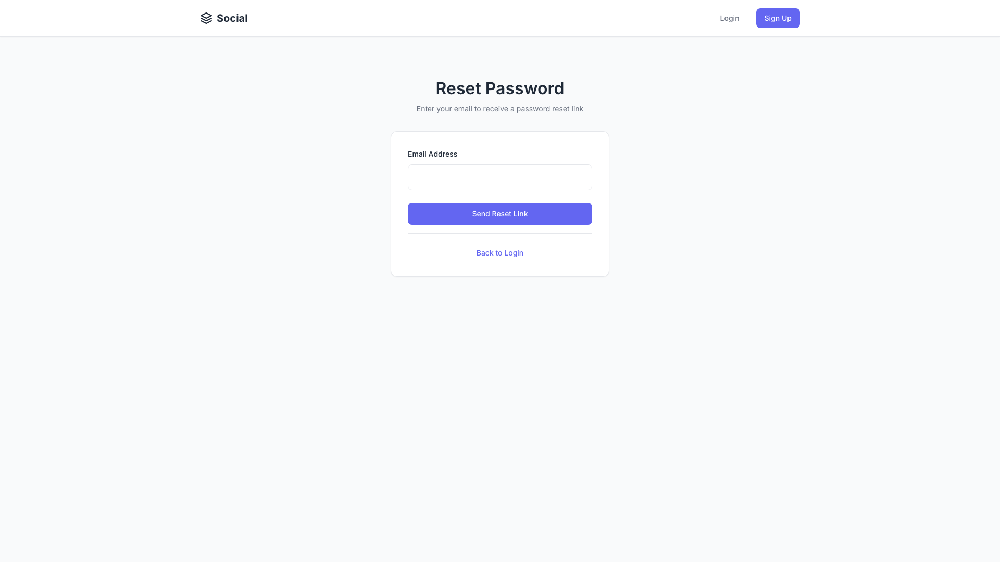
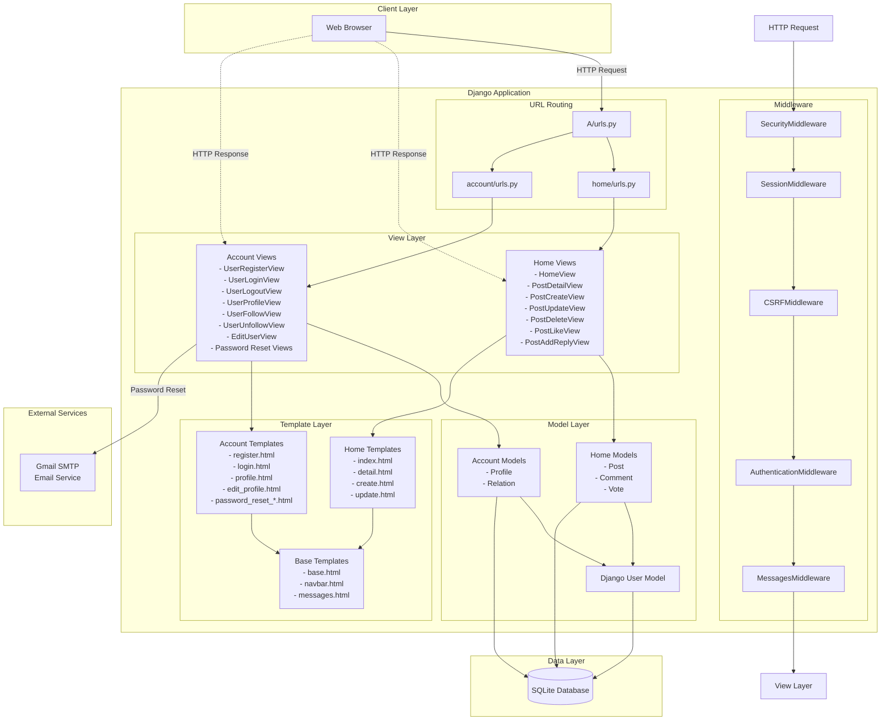
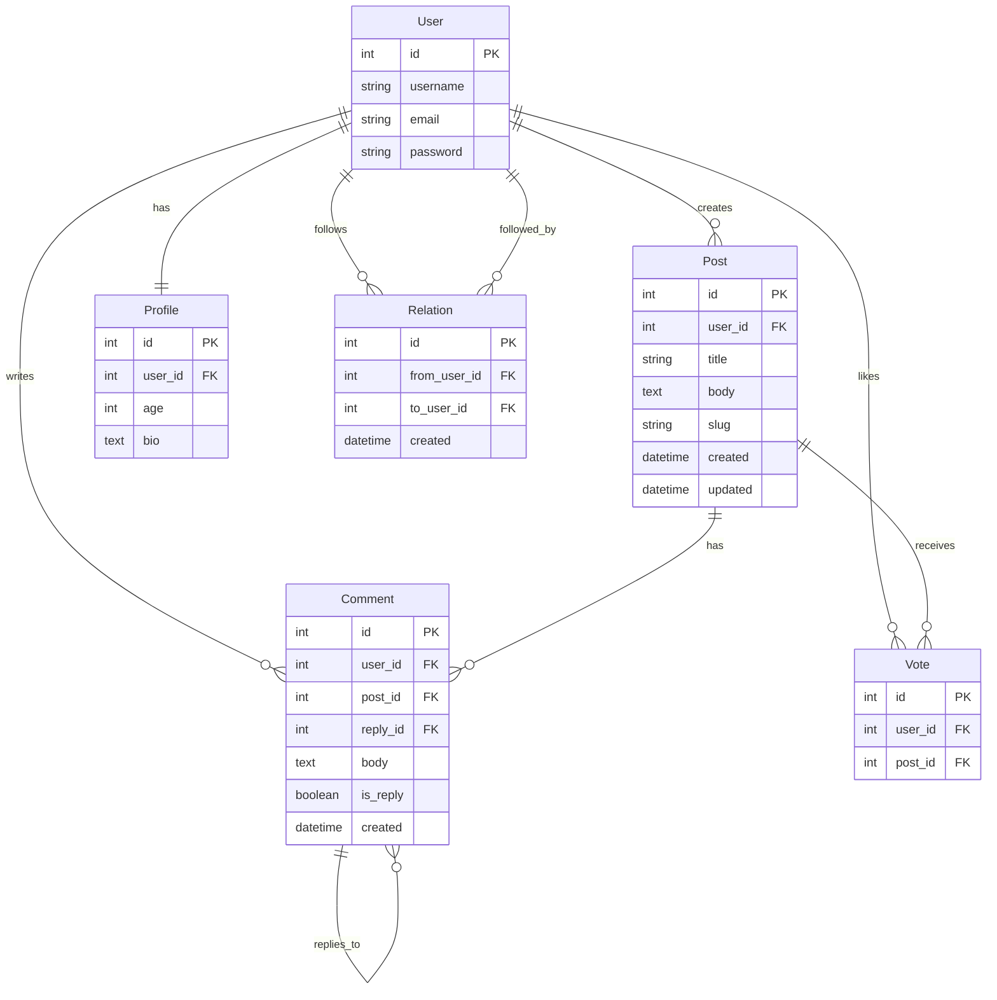

# 🚀 Social Media Platform

A full-featured social media web application built with Django, allowing users to create posts, interact with content, and connect with others.


## 📋 Table of Contents

- [Overview](#overview)
- [Screenshots](#screenshots)
- [Features](#features)
- [Tech Stack](#tech-stack)
- [Architecture](#architecture)
- [Project Structure](#project-structure)
- [Installation](#installation)
- [Usage](#usage)
- [API Endpoints](#api-endpoints)
- [Contributing](#contributing)

## 🎯 Overview

This is a Django-based social media platform that enables users to:
- Create and manage their profiles
- Share posts with the community
- Engage through comments and replies
- Like posts from other users
- Follow and unfollow users
- Search for posts
- Reset passwords via email

The application follows Django best practices with a clean architecture, class-based views, and a modular app structure.

## 📸 Screenshots

### Home Page
The main feed displaying all posts with a modern, minimal design.



### Login Page
Clean and professional login interface with email/username support.



### Registration Page
User-friendly registration form with validation.



### Post Detail Page
Detailed view of a post with comments and replies section.



### User Profile
User profile page showing bio, posts, and follow/unfollow functionality.


### Create Post
Modern form for creating new posts with title and body fields.



### Edit Profile
Profile editing interface for updating user information.



### Password Reset
Password reset flow with email verification.



## ✨ Features

### User Management
- ✅ User registration and authentication
- ✅ Email-based login support
- ✅ Password reset functionality via email
- ✅ User profiles with bio and age
- ✅ Profile editing

### Social Features
- ✅ Create, read, update, and delete posts
- ✅ Comment on posts
- ✅ Reply to comments (nested comments)
- ✅ Like/unlike posts
- ✅ Follow/unfollow other users
- ✅ View user profiles and their posts
- ✅ Search posts by content

### Security
- ✅ CSRF protection
- ✅ Password validation
- ✅ Login required decorators
- ✅ User permission checks

## 🛠 Tech Stack

### Backend
- **Django 5.2.4** - High-level Python web framework
- **Python 3.13** - Programming language
- **SQLite** - Lightweight database (development)

### Django Components
- **Django Auth** - User authentication system
- **Django Sessions** - Session management
- **Django Messages** - User feedback messages
- **Django Admin** - Administrative interface
- **Django Templates** - Server-side rendering

### Email Service
- **SMTP (Gmail)** - Email backend for password reset

## 🏗 Architecture

The application follows Django's Model-View-Template (MVT) architecture pattern:



### Data Model Relationships



## 📁 Project Structure

```
social/
├── A/                          # Main project directory
│   ├── A/                      # Project settings
│   │   ├── settings.py         # Django settings
│   │   ├── urls.py             # Root URL configuration
│   │   ├── wsgi.py             # WSGI config
│   │   └── asgi.py             # ASGI config
│   │
│   ├── account/                # Account management app
│   │   ├── models.py           # Profile, Relation models
│   │   ├── views.py            # Authentication & profile views
│   │   ├── forms.py            # User forms
│   │   ├── urls.py             # Account URL routes
│   │   ├── authenticate.py     # Custom email authentication
│   │   └── templates/          # Account templates
│   │
│   ├── home/                   # Home/Posts app
│   │   ├── models.py           # Post, Comment, Vote models
│   │   ├── views.py            # Post & comment views
│   │   ├── forms.py            # Post & comment forms
│   │   ├── urls.py             # Home URL routes
│   │   └── templates/          # Home templates
│   │
│   ├── templates/              # Base templates
│   │   ├── base.html
│   │   ├── 404.html
│   │   └── inc/                # Template includes
│   │
│   ├── db.sqlite3              # SQLite database
│   └── manage.py               # Django management script
│
└── venv/                       # Virtual environment
```

## 🚀 Installation

### Prerequisites

- Python 3.13 or higher
- pip (Python package manager)
- Git

### Step 1: Clone the Repository

```bash
git clone <repository-url>
cd social
```

### Step 2: Create Virtual Environment

```bash
python3 -m venv venv
source venv/bin/activate  # On Windows: venv\Scripts\activate
```

### Step 3: Install Dependencies

```bash
pip install django==5.2.4
```

### Step 4: Run Migrations

```bash
cd A
python manage.py makemigrations
python manage.py migrate
```

### Step 5: Create Superuser (Optional)

```bash
python manage.py createsuperuser
```

### Step 6: Run Development Server

```bash
python manage.py runserver
```

The application will be available at `http://127.0.0.1:8000/`

## 💻 Usage

### Accessing the Application

1. **Home Page**: `http://127.0.0.1:8000/`
   - View all posts
   - Search posts
   - Navigate to post details

2. **Registration**: `http://127.0.0.1:8000/account/register/`
   - Create a new account

3. **Login**: `http://127.0.0.1:8000/account/login/`
   - Login with username/email and password

4. **Create Post**: `http://127.0.0.1:8000/post/create/`
   - Requires authentication
   - Create new posts with title and body

5. **User Profile**: `http://127.0.0.1:8000/account/profile/<user_id>/`
   - View user profile
   - See user's posts
   - Follow/unfollow users

### Key Functionalities

- **Posts**: Create, read, update, and delete your posts
- **Comments**: Add comments to posts and reply to existing comments
- **Likes**: Like posts (one like per user per post)
- **Follow System**: Follow other users to see their content
- **Search**: Search posts by content
- **Password Reset**: Reset password via email link

## 🔌 API Endpoints

### Home App Endpoints

| Endpoint | Method | Description | Auth Required |
|----------|--------|-------------|---------------|
| `/` | GET | Home page with all posts | No |
| `/post/<id>/<slug>/` | GET | Post detail page | No |
| `/post/create/` | GET, POST | Create new post | Yes |
| `/post/update/<id>/` | GET, POST | Update post | Yes (Owner) |
| `/post/delete/<id>/` | GET | Delete post | Yes (Owner) |
| `/like/<id>/` | GET | Like a post | Yes |
| `/reply/<post_id>/<comment_id>/` | POST | Reply to comment | Yes |

### Account App Endpoints

| Endpoint | Method | Description | Auth Required |
|----------|--------|-------------|---------------|
| `/account/register/` | GET, POST | User registration | No |
| `/account/login/` | GET, POST | User login | No |
| `/account/logout/` | GET | User logout | Yes |
| `/account/profile/<id>/` | GET | User profile | Yes |
| `/account/edit_user/` | GET, POST | Edit profile | Yes |
| `/account/follow/<id>/` | GET | Follow user | Yes |
| `/account/unfollow/<id>/` | GET | Unfollow user | Yes |
| `/account/reset/` | GET, POST | Password reset | No |
| `/account/reset/done/` | GET | Password reset sent | No |
| `/account/confirm/<uidb64>/<token>/` | GET, POST | Password reset confirm | No |
| `/account/confirm/complete/` | GET | Password reset complete | No |

## 🔐 Configuration

### Email Settings

To enable password reset functionality, configure email settings in `A/A/settings.py`:

```python
EMAIL_BACKEND = 'django.core.mail.backends.smtp.EmailBackend'
EMAIL_HOST = 'smtp.gmail.com'
EMAIL_HOST_USER = 'your-email@gmail.com'
EMAIL_PORT = 587
EMAIL_HOST_PASSWORD = 'your-app-password'
EMAIL_USE_TLS = True
```

**Note**: For Gmail, you need to use an [App Password](https://support.google.com/accounts/answer/185833) instead of your regular password.

## 📝 License

This project is open source and available under the [MIT License](LICENSE).

## 👨‍💻 Author

Built with ❤️ using Django

---

**Note**: This is a development project. For production deployment, ensure proper security configurations, use a production database, and follow Django deployment best practices.

